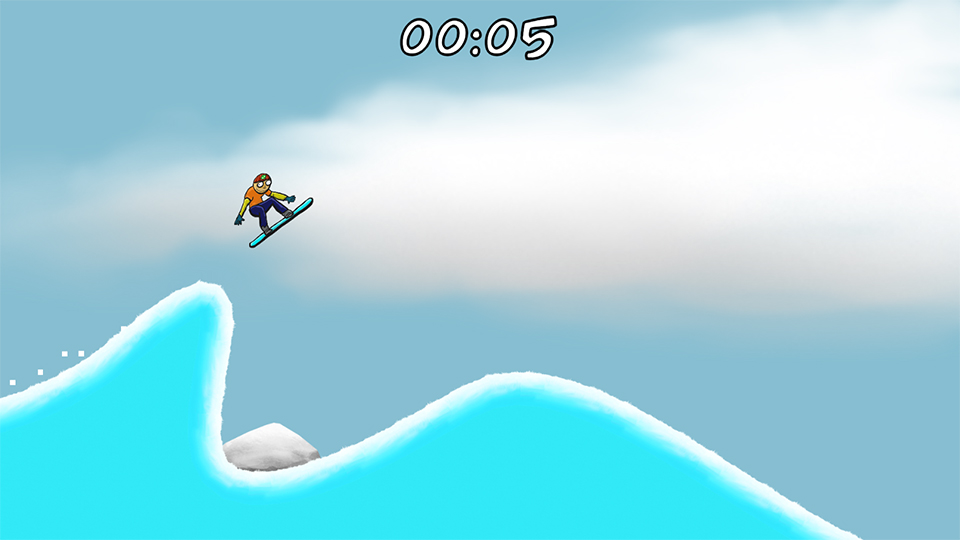
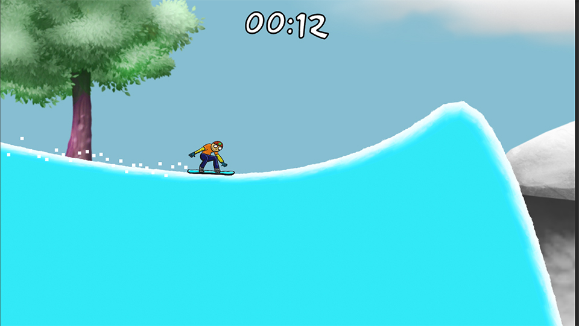

# SnowBoarder
Projeto pessoal de um jogo para estudar alguns recursos da Unity:
* Sprite Shapes
* Cinemachine com a câmera seguindo o player.
* Particle Effects

# Game
**Jogue agora em** https://play.unity.com/mg/other/webgl-builds-295945

# Screenshots

  

    <b>Level 1</b> 
    
  

  

    <b>Level 2</b> 
    
  

